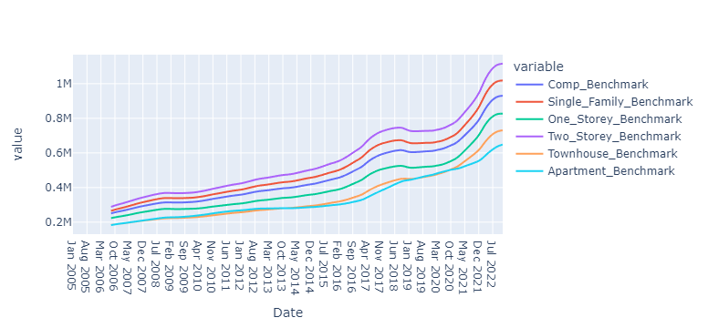

## ONTARIO AVERAGE HOUSING PRICE BENCHMARK ANALYSIS. VISUAL REPRESENTATION OF DATA

## Average Composite Benchmark of houses in Ontario cities for the last 17 years and the last two years and the last two year

  

## Graph showing trend in Housing Average Composite Benchmark for the last 17 years and the last 2 years
* Blue line is the last 17 years
* Orange line is the last 2 years

# Map showing Average Composite Benchmark for Ontario Housing Between 2017 and 2022

# Ontario cities Average Composite Benchmark, Rolling 20 day average window 

